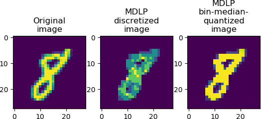

# MDLP discretized Fashion-MNIST and Handwritten Digits-MNIST datasets

[](https://opensource.org/licenses/MIT)
[](https://creativecommons.org/licenses/by-sa/3.0/)

<details><summary>Table of Contents</summary><p>

* [Why MDLP-Fashion-MNIST and MDLP-Digit-MNIST](#why-we-made-fashion-mnist)
* [Get the Data](#get-the-data)
* [Usage](#usage)
* [Benchmark](#benchmark)
* [Contributing](#contributing)
* [Citing](#citing)
* [License](#license)
</p></details><p></p>


`Fashion-MNIST` is a dataset consisting of [Zalando](https://jobs.zalando.com/tech/)'s article images. `Digit-MNIST` is a dataset of handwritten digits put together by LeCun and Cortes<sup>[1](#LecunCortes1998)</sup> from NIST's database of images of handwritten digits. Both contain a training set of 60,000 examples and a test set of 10,000 examples and are designed to be interchangeable: each example is a 28x28 grayscale image, associated with a label from 10 classes.

This dataset includes optimally discretized and quantized preprocessed versions of these data sets. Please see the samples below.




<a name="LecunCortes1998">1</a> : LeCun, Y., Bottou, L., Bengio, Y., and Haffner, P. (1998). Gradient-based learning applied to document recognition. Proceedings of the IEEE, 86, 2278–2324.

## Why MDLP-Fashion-MNIST and MDLP-Digit-MNIST

In our recent study<sup>[2](#Rasku2019)</sup> MDLP discretization of our feature data significantly improved the classification accuracy for algorithm selection. More specifically, we used the optimal binning procedure of Fayaad and Irani<sup>[3](#FayyadIrani1993)</sup>, which performs MDLP (minimal description length principle) discretization of continuous variables. Depending on the used classifier, we observed a 5-15 pp improvement in the classifier accuracy. Thus, we were interested in seeing which kind of effect MNIST datasets to see MDLP discretization has on these datasets that are favored by the AI/ML/Data Science community. For simple models we saw only modest improvements of at most 1 pp, but one is free to try with different ML approach. 

<a name="Rasku2019">2</a> : Rasku, J., Musliu, N., and Kärkkäinen, T. (2019). Algorithm Selection for Capacitated Vehicle Routing Problems. Proceedings of the 27th European Symposium on Artificial Neural Networks, Computational Intelligence and Machine Learning (ESANN 2019), pp. 373-378.

<a name="FayyadIrani1993">3</a> :  Fayyad, Usama M.; Irani, Keki B. (1993) "Multi-Interval Discretization of Continuous-Valued Attributes for Classification Learning" , Proceedings of the International Joint Conference on Uncertainty in AI (Q334 .I571 1993), pp. 1022-1027 https://trs.jpl.nasa.gov/handle/2014/35171

## Get the Data

The data is in the `data` folder of this repository. The Zalando  dataset appears under `data/fashion` and the handwritten digit dataset under `data/mnist`. This repo contains the scripts for benchmarking and visualization from Zalando. They are complemented by one script for applying MDLP and one for visualizing the differences between the original (in `data/fashion` / `data/mnist`), discretized (in `data/fashion_mdlp_discretized` / `data/mnist_mdlp_discretized`),  and quantized datasets (in `data/fashion_mdlp_quantized` / `data/fashion_mdlp_quantized`). The integer values in the discretized dataset are the bin indices. In quantized data the bin indices are replaced with the median grayscale value of each bin.

Please note that the MDLP implementation is included as `git` submodule, and you have to use the `--recursive` switch when cloning the repository.

```bash
git clone --recursive git@github.com:yorak/fashion-mnist.git
```

### Labels
In the MNIST dataset the labels correspond to the written digits. In Zalando fashion dataset each training and test example is assigned to one of the following labels:

| Label | Description |
| --- | --- |
| 0 | T-shirt/top |
| 1 | Trouser |
| 2 | Pullover |
| 3 | Dress |
| 4 | Coat |
| 5 | Sandal |
| 6 | Shirt |
| 7 | Sneaker |
| 8 | Bag |
| 9 | Ankle boot |

Note that MDLP uses these labels to create the discretization bin cuts. The test data is discretized using the model generated using the training data.

## Usage

### Loading data with Python (requires [NumPy](http://www.numpy.org/))

Use `utils/mnist_reader` in this repo:
```python
import mnist_reader
X_train, y_train = mnist_reader.load_mnist('data/fashion_mdlp_discretized', kind='train')
X_test, y_test = mnist_reader.load_mnist('data/fashion_mdlp_discretized', kind='t10k')
```

### Running the MDLP discretization (requires [NumPy](http://www.numpy.org/))

There is a script `utils/create_mdlp_mnist.py`, which, when ran, generates the MDLP preprocessed dataset `.gz` files. Change the `DATASET` constant to 

### Loading data with other languages

As one of the Machine Learning community's most popular datasets, MNIST has inspired people to implement loaders in many different languages. You can use these loaders with the `Fashion-MNIST` dataset as well. (Note: may require decompressing first.). However, these have not been tested on this data.

- [C](https://stackoverflow.com/a/10409376)
- [C++](https://github.com/wichtounet/mnist)
- [Java](https://stackoverflow.com/a/8301949)
- [Python](https://pypi.python.org/pypi/python-mnist) and [this](https://pypi.python.org/pypi/mnist) and [this]((https://www.brine.io/fashion-mnist/train))
- [Scala](http://mxnet.io/tutorials/scala/mnist.html)
- [Go](https://github.com/schuyler/neural-go/blob/master/mnist/mnist.go)
- [C#](https://jamesmccaffrey.wordpress.com/2013/11/23/reading-the-mnist-data-set-with-c/)
- [NodeJS](https://github.com/ApelSYN/mnist_dl) and [this](https://github.com/cazala/mnist)
- [Swift](https://github.com/simonlee2/MNISTKit)
- [R](https://gist.github.com/brendano/39760) and [this](https://github.com/maddin79/darch)
- [Matlab](http://ufldl.stanford.edu/wiki/index.php/Using_the_MNIST_Dataset)
- [Ruby](https://github.com/gbuesing/mnist-ruby-test/blob/master/train/mnist_loader.rb)

## Benchmark
Zalando built an automatic benchmarking system based on `scikit-learn` that covers 129 classifiers (but no deep learning) with different parameters. [Find the results here](http://fashion-mnist.s3-website.eu-central-1.amazonaws.com/).

You can reproduce the results by running `benchmark/runner.py`. Please see the original [zalandoresearch/fashion-mnist](https://github.com/zalandoresearch/fashion-mnist) for a table of results, and feel free to submit any interesting results with the MDLP discretized dataset.

## Contributing

For any improvements to the original dataset, pelase refer to [zalandoresearch/fashion-mnist](https://github.com/zalandoresearch/fashion-mnist) Github repostorory.

## Citing
If you use Fashion-MNIST in a scientific publication, we would appreciate references to the following paper:

**Fashion-MNIST: a Novel Image Dataset for Benchmarking Machine Learning Algorithms. Han Xiao, Kashif Rasul, Roland Vollgraf. [arXiv:1708.07747](http://arxiv.org/abs/1708.07747)**

For digits-MNIST the corresponding paper is:

**LeCun, Y., Bottou, L., Bengio, Y., and Haffner, P. (1998). Gradient-based learning applied to document recognition. Proceedings of the IEEE, 86, 2278–2324.**

For the MDLP method please cite:

**Fayyad, Usama M.; Irani, Keki B. (1993) "Multi-Interval Discretization of Continuous-Valued Attributes for Classification Learning" , Proceedings of the International Joint Conference on Uncertainty in AI (Q334 .I571 1993), pp. 1022-1027.**

## License

The fashion-MNIST data and utils use the MIT License (MIT) Copyright © [2017] Zalando SE, https://tech.zalando.com

According to [kaggle.com](https://www.kaggle.com/c/atzb-mnist-digit-classification) the digits-MNIST data is licensed under [Creative Commons Attribution-Share Alike 3.0 license](https://creativecommons.org/licenses/by-sa/3.0/).

The Python implementation of MDLP by Github user (navicto)[https://github.com/navicto] is licensed under GPLv3. It is included as a `git` submodule.

